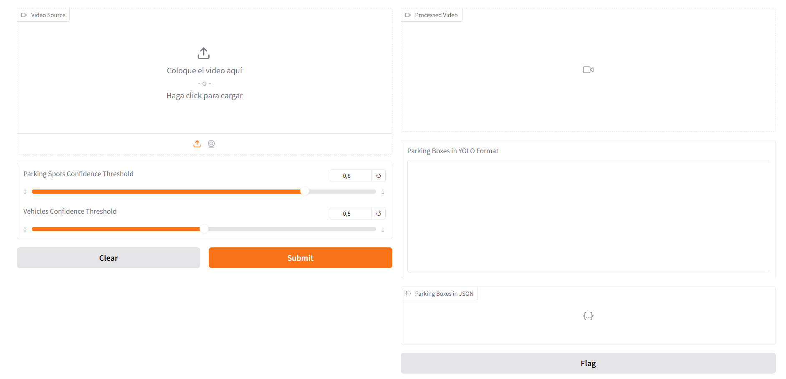
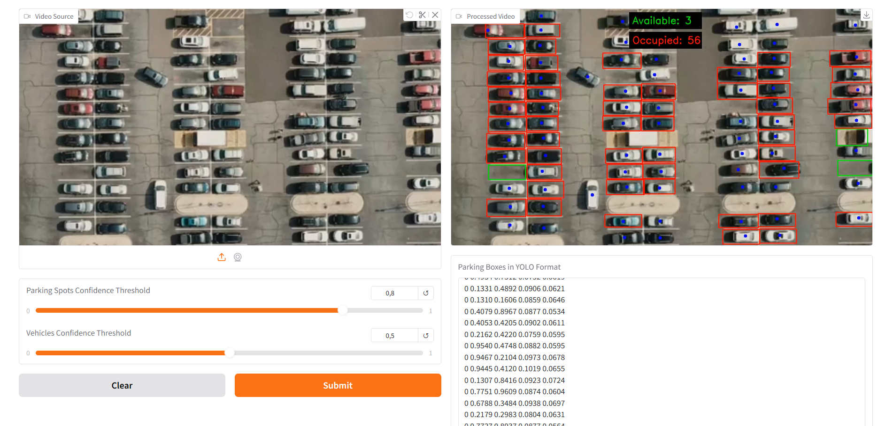
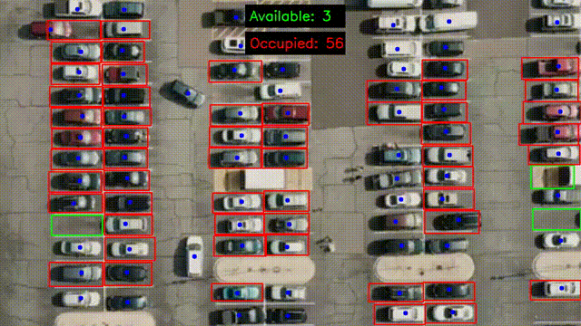

# ParkingSpotDetection

## Project Description

**A project to detect parking spots and vehicle occupancy using YOLO.**  
The system identifies parking spots, detects vehicles, and determines whether a parking spot is occupied or available. Occupancy is determined by calculating the centroid of the vehicle and checking if it falls within the boundaries of the parking spot. If the vehicle's centroid is inside the parking spot, it is considered occupied.

This project utilizes fine-tuned YOLO models for object detection, specifically trained on datasets of aerial and satellite imagery to improve accuracy.

## Features

- Detect parking spots from an aerial view.
- Identify vehicles in the parking lot.
- Determine if parking spots are occupied or available.

## Models
- **yolo11n-detect-parking.pt**: Model to detect individual parking spots. This model has been trained by us. The details of where we obtained the datasets will be provided below.
- **yolov8n-visdrone.pt**: Model to detect objects from an aerial view. This model was not trained by us. [Download yolov8n-visdrone.pt](https://huggingface.co/mshamrai/yolov8n-visdrone)

## Datasets

The datasets used in this project are publicly available. The process of acquiring and adapting them to the required format for training is explained step-by-step in the following notebooks:

- [training_model_world_yolo](notebooks/training_model_world_yolo.ipynb)
- [training_model_dt](notebooks/training_model_dt.ipynb)

## Results

### Interface

### Processed Video with Interface

### Processed Video

